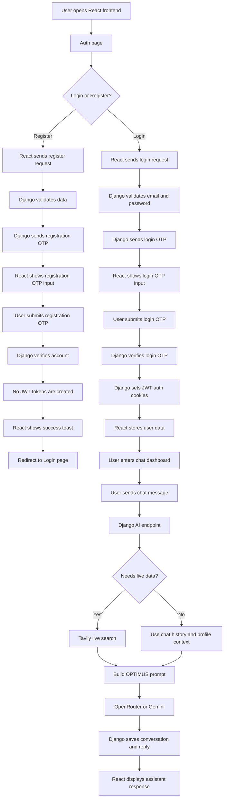
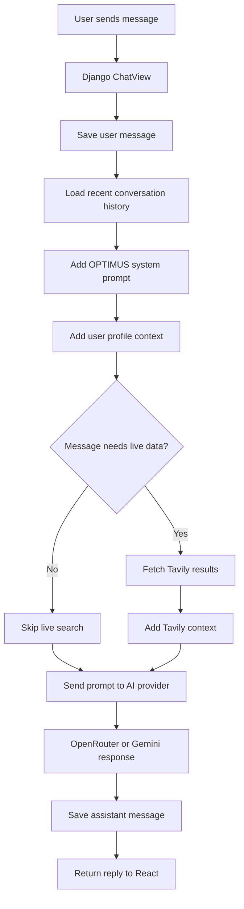
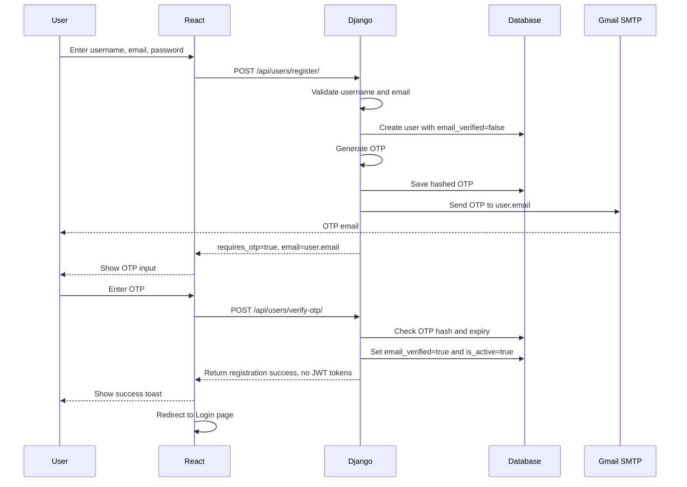
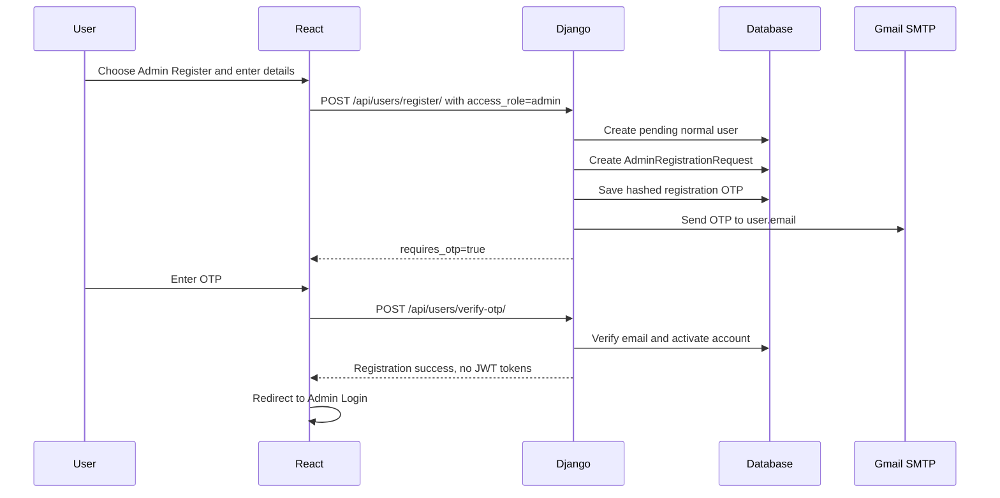
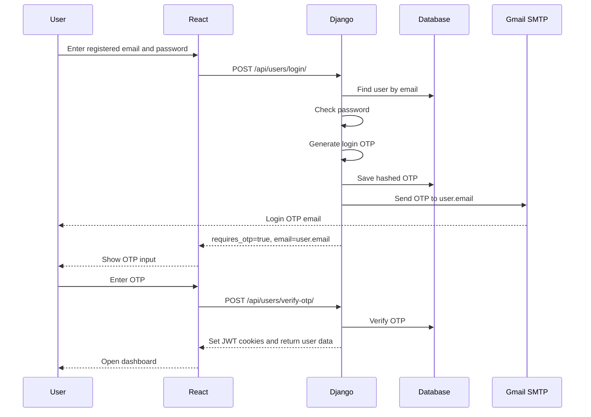
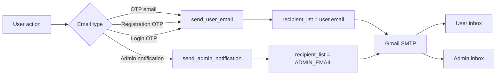
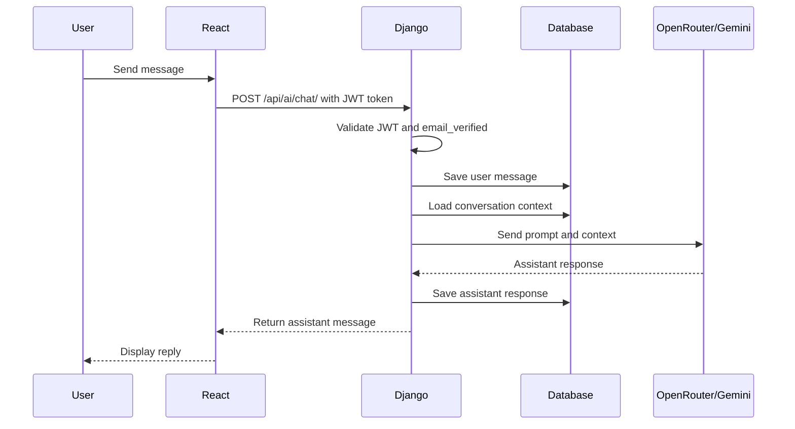
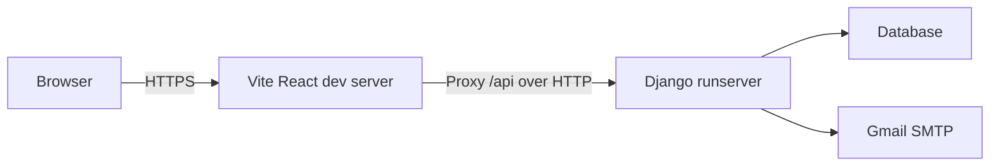

# OPTIMUS Full-Stack AI Chat

React + Django REST Framework chat app with OTP email verification, JWT auth, conversation history, Tavily live web search, and OpenRouter/Gemini AI integration.

Created by Sridhar.

## Project Structure

```text
chartbot/
  backend/
    ai/
    config/
    users/
    manage.py
    requirements.txt
    .env.example
  frontend/
    src/
      components/
      pages/
      services/
    package.json
    .env.example
```

## Workflow Presentation

The project workflow slide deck is maintained in [`project_workflow_presentation.md`](./project_workflow_presentation.md).

It is now plain Markdown with Marp front matter and `---` slide separators, so it works in normal Markdown preview and in Marp-based slide/export tools. In VS Code, install the **Marp for VS Code** extension, open `project_workflow_presentation.md`, and use Marp preview or export to PDF/PPTX.

## Backend Setup

```bash
cd backend
python -m venv venv
venv\Scripts\activate
pip install -r requirements.txt
copy .env.example .env
python manage.py migrate
python manage.py runserver
```

Add at least one AI provider key in `backend/.env`:

- `OPENROUTER_API_KEY` for OpenRouter
- `GEMINI_API_KEY` for direct Gemini
- `TAVILY_API_KEY` for live web search and latest/current information

If `AI_PROVIDER=auto`, the backend tries OpenRouter first when configured, then falls back to Gemini when Gemini is configured and OpenRouter cannot complete the request.

## Frontend Setup

```bash
cd frontend
npm install
copy .env.example .env
npm run dev
```

Open the Vite URL:

```text
https://localhost:5174
```

For LAN testing, use:

```text
https://192.168.0.5:5174
```

The frontend uses a Vite proxy for API calls. Browser requests go to `/api/...` on the frontend server, and Vite forwards them to Django at `http://127.0.0.1:8000`.

## Environment Notes

- PostgreSQL is the recommended primary database for development and production.
- Set `DB_ENGINE=postgres` and the PostgreSQL variables in `backend/.env`.
- JWT access and refresh tokens are set as auth cookies only after successful login OTP verification.
- Registration OTP verification activates the account but does not create a login session.
- OTP emails are sent to the registered user's email address.
- `ADMIN_EMAIL` is only for admin notifications and sender fallback.
- `SHOW_DEV_OTP=False` keeps OTP hidden from the frontend.
- The AI endpoint requires authentication and verified email.
- `TAVILY_API_KEY` enables live web data for current/latest/news/price/weather-style questions.
- OPTIMUS identifies Sridhar as the creator when asked who built the system.

## Database Configuration

### Database Engine

OPTIMUS uses **PostgreSQL** as the primary database for development and production environments. SQLite can still be used as a local fallback if `DB_ENGINE` is not set to `postgres`.

### PostgreSQL Features Used

- User authentication storage
- OTP verification records
- Conversation management
- Chat message history
- User memory system
- Resume analysis results
- NLP analytics
- Response cache
- AI activity logs

### PostgreSQL Environment Variables

```env
DB_ENGINE=postgres
POSTGRES_DB=chartbot
POSTGRES_USER=postgres
POSTGRES_PASSWORD=your_password
POSTGRES_HOST=localhost
POSTGRES_PORT=5432
```

### Django Database Configuration

```python
DATABASES = {
    "default": {
        "ENGINE": "django.db.backends.postgresql",
        "NAME": os.getenv("POSTGRES_DB"),
        "USER": os.getenv("POSTGRES_USER"),
        "PASSWORD": os.getenv("POSTGRES_PASSWORD"),
        "HOST": os.getenv("POSTGRES_HOST", "localhost"),
        "PORT": os.getenv("POSTGRES_PORT", "5432"),
    }
}
```

### Install PostgreSQL Driver

The project uses Psycopg 3:

```bash
pip install "psycopg[binary]==3.2.3"
```

Or install all backend requirements:

```bash
cd backend
pip install -r requirements.txt
```

### Create Database

```sql
CREATE DATABASE chartbot;
```

### Apply Migrations

```bash
cd backend
python manage.py makemigrations
python manage.py migrate
```

### Database Tables

- `users_user`: stores registered users and authentication data.
- `users_emailotp`: stores OTP verification records.
- `ai_conversation`: stores user conversations.
- `ai_message`: stores chat messages and AI responses.
- `ai_memory`: stores user memories and preferences.
- `ai_nlpevent`: stores NLP analytics and tracking.
- `ai_responsecache`: stores cached AI responses.
- `ai_resumeanalysis`: stores resume analysis reports.
- `ai_document` and `ai_documentchunk`: store uploaded documents and RAG chunks.
- `ai_ragquery`: stores document Q&A activity.
- `ai_faq`: stores fast local FAQ responses.

### Database Workflow

```text
User -> PostgreSQL -> Django REST API -> AI Services -> PostgreSQL -> React Frontend
```

All user data, chat history, OTP records, memories, resume analyses, NLP events, cache entries, uploaded document metadata, and AI interactions are stored through Django ORM.

### Production Database

- Database: PostgreSQL
- ORM: Django ORM
- Driver: Psycopg 3 (`psycopg[binary]`)
- Migration tool: Django migrations

Benefits:

- High performance
- ACID compliance
- Scalable architecture
- Production-ready operations
- Advanced indexing support
- Secure data storage
- Cloud deployment support

## Data Storage

OPTIMUS uses PostgreSQL as its primary database. All application data is managed through Django ORM and persisted in PostgreSQL.

### Stored Data

The following information is stored in PostgreSQL:

- User accounts and authentication records
- Email OTP verification records
- User profiles and preferences
- Conversations and chat history
- AI-generated responses
- User memory data
- NLP analytics and sentiment records
- Resume analysis reports
- Uploaded document metadata
- RAG document chunks
- Response cache entries
- AI activity logs
- FAQ records

### Database Architecture

```text
React Frontend
       |
       v
Django REST Framework
       |
       v
Django ORM
       |
       v
PostgreSQL
```

### PostgreSQL Tables

```text
users_user
users_emailotp

ai_conversation
ai_message
ai_memory
ai_nlpevent
ai_responsecache
ai_resumeanalysis
ai_document
ai_documentchunk
ai_ragquery
ai_faq
```

### Storage Policy

- Authentication data is stored in PostgreSQL.
- OTP verification records are stored in PostgreSQL.
- Chat conversations and messages are stored in PostgreSQL.
- User memories and preferences are stored in PostgreSQL.
- Resume analysis results are stored in PostgreSQL.
- NLP analytics are stored in PostgreSQL.
- Uploaded document metadata is stored in PostgreSQL.
- AI interaction logs are stored in PostgreSQL.
- Cached responses are stored in PostgreSQL.

### Technology Stack

- Database: PostgreSQL
- ORM: Django ORM
- Driver: Psycopg 3
- Backend: Django REST Framework
- Frontend: React + Vite

### Data Flow

```text
User
  |
  v
React Frontend
  |
  v
Django REST API
  |
  v
Django ORM
  |
  v
PostgreSQL
  |
  v
AI Services (OpenRouter/Gemini/Tavily)
  |
  v
PostgreSQL
  |
  v
Frontend Response
```

PostgreSQL serves as the central persistence layer for OPTIMUS, storing user data, conversations, memories, analytics, resume analyses, documents, and AI interaction records.

## Secure Cookie JWT Auth

JWTs are set in httpOnly cookies by the backend after login OTP verification. The frontend stores user profile data for routing, but it does not need to store JWT access or refresh tokens in `localStorage`.

Backend settings:

```python
REST_FRAMEWORK = {
    "DEFAULT_AUTHENTICATION_CLASSES": (
        "users.authentication.CookieJWTAuthentication",
    ),
}

JWT_AUTH_COOKIE = "optimus_access"
JWT_REFRESH_COOKIE = "optimus_refresh"
JWT_COOKIE_HTTPONLY = True
JWT_COOKIE_SECURE = True
JWT_COOKIE_SAMESITE = "Strict"
CORS_ALLOW_CREDENTIALS = True
```

Login OTP verification responses set cookies:

```python
response.set_cookie("optimus_access", access, httponly=True, secure=True, samesite="Strict")
response.set_cookie("optimus_refresh", refresh, httponly=True, secure=True, samesite="Strict")
```

The custom DRF auth class reads `optimus_access` from cookies and can also authenticate bearer tokens. `/api/token/refresh/` reads `optimus_refresh` from cookies, rotates tokens, and sets fresh cookies. Logout clears both cookies.

Axios is configured to send cookies with API requests:

```js
axios.create({ baseURL: API_BASE_URL, withCredentials: true });
```

On a `401` from a protected API, React calls `/api/token/refresh/` with credentials and retries the original request if refresh succeeds. Public auth pages skip the startup session check when no session is stored, so logged-out login/register pages do not spam refresh attempts.

## Chat Rate Limiting

`POST /api/ai/chat/` uses DRF throttling with a custom `ChatUserRateThrottle`.

```python
class ChatUserRateThrottle(UserRateThrottle):
    scope = "chat_user"

class ChatView(APIView):
    throttle_classes = [ChatUserRateThrottle]
```

Configure the rate in `backend/.env`:

```env
CHAT_USER_THROTTLE_RATE=20/min
```

If the limit is hit, the API returns a `429` with a frontend-displayable detail message such as:

```text
Chat rate limit reached. Please wait 42 seconds before sending another message.
```

## SpaCy NLP Setup

Entity extraction uses SpaCy model `en_core_web_sm`. This model provides lightweight English named entity recognition for names, places, organizations, and dates. If SpaCy or the model is missing, the app still works but entity extraction degrades to regex-only patterns such as detecting `my name is ...`.

Install and verify:

```bash
cd backend
pip install -r requirements.txt
python -m spacy download en_core_web_sm
python manage.py check_nlp_deps
```

The `check_nlp_deps` command prints a warning when SpaCy or `en_core_web_sm` is unavailable.

## AI Provider Fallback

When `AI_PROVIDER=auto`, the backend tries OpenRouter first when configured. If OpenRouter fails and `GEMINI_API_KEY` is configured, the request falls back to Gemini and logs the OpenRouter failure reason.

This includes provider-side auth, quota, timeout, connection, and `5xx` failures. If Gemini is not configured, OpenRouter errors surface immediately so configuration problems remain visible.

Check the last provider decision:

```text
GET /api/ai/provider-status/
```

The response includes the configured provider, active provider, and whether fallback occurred in the last request.

## Live Memory Sync

Chat memory actions are handled locally by Django and immediately reflected in the database and Memory Manager UI.

Supported chat actions:

- Save: `save my favourite movie name is jersy`, `remember my favorite color is blue`, `my hobby is watch a movie`
- Update: `update my favorite color to red`, `now my hobby is reading`
- Delete: `remove my color`, `delete my memory my favourite colour is blue`, `forget my hobby`
- Retrieve: `show my memories`, `what do you remember`

Every memory action returns a `memory_sync` payload from `POST /api/ai/chat/`:

```json
{
  "action": "save",
  "status": "success",
  "updated_memory_list": [
    {
      "memory_id": "1",
      "key": "movie_name",
      "value": "jersy"
    }
  ],
  "message": "Memory saved successfully"
}
```

The frontend listens for this payload and refreshes `MemoryManager.jsx` from the returned live database state. Duplicate overlapping save patterns are deduplicated by normalized key before the response is rendered.

## Chat Scroll Persistence

The chat view preserves scroll position across workspace navigation and component remounts.

Browser storage keys:

- `chat_scroll_position`
- `chat_last_message_id`

Restore priority:

1. `chat_last_message_id`
2. `chat_scroll_position`
3. Default top position if no saved state exists

When the user sends a new message, auto-scroll to the latest message overrides the saved position. When the user is reading older messages and switches to Memory, NLP, Resume, Docs, profile, or another workspace, returning to Chat restores the same viewed message or scroll offset.

## Response Cache Expiry

`ResponseCache` entries include `created_at`, `ttl_seconds`, and `is_web_result`.

- Static/FAQ-style cached responses use `ttl_seconds=None` and can live forever.
- Web-result cache entries use `TAVILY_CACHE_TTL_SECONDS` (`900` seconds by default).
- `web_search` intent skips cache lookup entirely and always fetches fresh Tavily results.

Purge expired cache rows:

```bash
cd backend
python manage.py purge_expired_cache
```

## Resume OCR Dependencies

Resume PDF text extraction uses `pdfplumber` first. If extracted text is empty or under 100 characters, the backend logs a warning and falls back to OCR with `pdf2image` and `pytesseract`.

Python requirements:

```text
pdfplumber
pdf2image
pytesseract
```

OCR also requires system tools:

- Tesseract OCR installed and available on `PATH`
- Poppler installed and available on `PATH` for `pdf2image`

## Global Markdown Rendering

All AI-generated text is rendered through one reusable component:

```text
frontend/src/components/common/MarkdownRenderer.jsx
frontend/src/components/common/MarkdownRenderer.css
```

Installed libraries:

```bash
cd frontend
npm install react-markdown remark-gfm rehype-highlight
```

Use this component for every current and future AI output surface:

```jsx
import MarkdownRenderer from "../components/common/MarkdownRenderer.jsx";

<MarkdownRenderer content={content} />
```

The renderer supports headings, bold, italic, strikethrough, bullet and numbered lists, checklists, tables, links, blockquotes, horizontal rules, inline code, fenced code blocks, and GitHub Flavored Markdown. It is currently used in chat responses, document/RAG answers, resume analysis output, memory values, and NLP entity details.

## Main API Endpoints

- `POST /api/users/register/`
- `POST /api/users/login/`
- `POST /api/users/verify-otp/`
- `POST /api/users/logout/`
- `GET /api/users/me/`
- `PATCH /api/users/me/`
- `POST /api/token/refresh/`
- `GET /api/ai/conversations/`
- `POST /api/ai/chat/`

## Project Workflow

This is the high-level flow of the project from browser to database, live search, and AI provider.



### Step-by-Step Application Workflow

This is the full OPTIMUS workflow from local startup to authenticated chat and admin access.

1. **Start the backend**
   - Developer runs Django with `python manage.py runserver`.
   - Django loads `.env`, database settings, AI provider keys, email settings, CORS settings, and JWT cookie settings.
   - Django connects to PostgreSQL through Django ORM.

2. **Start the frontend**
   - Developer runs Vite with `npm run dev`.
   - React loads the app at `https://localhost:5174` or the LAN HTTPS URL.
   - Vite proxies browser `/api/...` requests to Django at `http://127.0.0.1:8000`.

3. **Open the auth screen**
   - User opens the frontend in the browser.
   - React checks `/api/users/me/` to see whether an authenticated session already exists.
   - If no valid session exists, React shows the auth page.

4. **Select role and method**
   - User selects a role from the auth form: `User` or `Admin`.
   - User selects a method: `Login` or `Register`.
   - User routes:
     - User login: `/login`
     - User register: `/register`
     - Admin login: `/admin/login`
     - Admin register: `/admin/register`

5. **User registration flow**
   - React sends registration details to `POST /api/users/register/`.
   - Django validates email, username, password, and confirm password.
   - Django creates or updates a pending user with `email_verified=False`.
   - Django generates an OTP, stores the hashed OTP in PostgreSQL, and emails the code to `user.email`.
   - React shows the OTP verification form.
   - After registration OTP verification, Django sets `email_verified=True` and `is_active=True`.
   - Registration OTP verification does not return JWT tokens and does not set auth cookies.
   - React shows a registration success toast and redirects the user to the Login page.

6. **Admin registration request flow**
   - If a non-admin chooses Admin Register, Django creates a normal pending user and an `AdminRegistrationRequest` row.
   - Django still sends the registration OTP for new or unverified admin registrations.
   - Django does not grant admin access automatically.
   - After OTP verification, React redirects to Admin Login instead of opening the dashboard.
   - An existing admin or super admin must approve/promote the account before admin access is allowed.
   - The primary super admin email `sivasridhar2502@gmail.com` is always saved as `super_admin`.

7. **Login flow**
   - React sends email and password to `POST /api/users/login/`.
   - Django checks the password.
   - Login does not return JWT tokens immediately.
   - Django sends an OTP to the account email.
   - React shows the OTP verification form.

8. **Admin login guard**
   - Admin Login is allowed only for roles `super_admin`, `admin`, or `moderator`.
   - If a normal user tries Admin Login, Django returns an admin-only access message.
   - Normal users must use User Login and are routed to `/chat`.

9. **OTP verification**
   - React sends email and OTP to `POST /api/users/verify-otp/`.
   - Django checks the OTP hash, expiry, attempt count, and matching email.
   - For registration OTPs, Django marks the user as active and email verified, returns a success message, and does not create JWT tokens.
   - For login OTPs, Django returns authenticated user data and sets JWT access and refresh cookies.
   - The frontend stores user/session data only after login OTP verification.

10. **Role-based redirect**
    - After registration OTP verification, React redirects to Login.
    - After login OTP verification, if `user.role` is `super_admin`, `admin`, or `moderator`, React redirects to `/admin`.
    - After login OTP verification, if `user.role` is `user`, React redirects to `/chat`.
    - If a normal user manually opens `/admin`, React shows an admin-only access message.

11. **Chat request flow**
    - Authenticated user sends a message from the chat page.
    - React posts the message to `POST /api/ai/chat/`.
    - Django verifies JWT authentication and email verification.
    - Django runs NLP analysis for intent, sentiment, and entities.
    - Django saves the user message in PostgreSQL.

12. **Local response and cache checks**
    - Django checks fast local handlers for FAQ, greetings, profile, memory save, memory update, memory delete, and memory retrieval.
    - Django checks `ResponseCache` for eligible non-live responses.
    - If a local or cached answer is found, Django saves and returns it immediately.

13. **Live web search flow**
    - If the query needs current data, Django calls Tavily.
    - Tavily results are added to the prompt context.
    - Web-search responses use a short cache TTL or bypass cache depending on intent.

14. **AI provider flow**
    - Django builds the OPTIMUS system prompt with user profile, memories, NLP metadata, and recent conversation history.
    - Django sends the prompt to OpenRouter or Gemini based on `AI_PROVIDER`.
    - If `AI_PROVIDER=auto`, OpenRouter is tried first when configured, then Gemini is used as fallback when Gemini is configured and OpenRouter cannot complete the request.

15. **Response storage and display**
    - Django saves the assistant response as an `ai_message` row.
    - Django logs NLP and AI activity metadata.
    - React receives the response and renders it with Markdown support.

16. **Admin dashboard workflow**
    - Admin users open `/admin`.
    - React loads `AdminDashboard.jsx`.
    - Admin APIs return dashboard metrics, users, conversations, analytics, memories, resume analyses, and settings data.
    - Admin actions are protected by backend role checks.

17. **Document and RAG workflow**
    - User uploads a document from the document page.
    - Django stores document metadata in PostgreSQL.
    - Document chunks and RAG query metadata are stored through Django ORM.
    - User asks questions against uploaded documents, and OPTIMUS answers from retrieved context.

18. **Resume analysis workflow**
    - User uploads a resume PDF.
    - Django extracts text with PDF parsing and OCR fallback when needed.
    - Django analyzes skills, sections, suggestions, and interview questions.
    - Results are stored in PostgreSQL and shown in the frontend.

19. **Logout workflow**
    - User clicks logout.
    - React calls `POST /api/users/logout/`.
    - Django clears auth cookies.
    - React clears stored session data and returns to the login page.

### Complete Chatbot Request-Response Workflow (Step-by-Step)

Below is the step-by-step journey of a chat message through the OPTIMUS chatbot system:

1. **User Interaction (Frontend)**:
   - The user types a message in the React chatbot interface and clicks send.
   - The React client sends a `POST` request to `/api/ai/chat/` containing the `message` (raw text query) and an optional `conversation_id`.
   - The request includes auth cookies, and the backend reads the JWT access token from the `optimus_access` cookie.

2. **Authentication & Permissions (Backend)**:
   - Django REST Framework (DRF) JWT middleware intercepts the request to validate the token and verify the user.
   - The `IsEmailVerified` permission class ensures that only users with verified emails (via OTP) can access the AI endpoint.

3. **Natural Language Processing (NLP) Analysis**:
   - The message is analyzed by `process_message()` in `backend/ai/nlp.py`.
   - **Entity Extraction**: Scans the text using SpaCy (with regex fallback) to identify names, dates, places, and organizations.
   - **Sentiment Analysis**: Uses TextBlob to determine message polarity (`positive`, `neutral`, `negative`) and calculate a score from `-1.0` to `1.0`.
   - **Intent Detection**: Analyzes query structure to map the message to a specific intent: `faq`, `greeting`, `profile`, `save_memory`, `update_memory`, `delete_memory`, `retrieve_memory`, `resume_analysis`, `web_search`, or `general_chat`.

4. **Database Record Creation**:
   - If `conversation_id` is provided, Django retrieves the conversation. If not, a new `Conversation` record is created (titling it with the first 80 characters of the message).
   - The message is saved as a `Message` record with `role="user"`, storing the text along with intent, sentiment metrics, and extracted entities.
   - An `NLPEvent` record is logged to track usage statistics and performance indicators.

5. **Fast Local Response Handling**:
   - The backend checks if the intent can be resolved without making an external AI API call:
     - **FAQ**: Predefined answers (such as creator queries: *"This AI system was built by Sridhar"*) are returned immediately.
     - **Greeting/Politeness**: A personalized welcome or goodbye is formulated using the user's name or display name.
     - **Profile**: Account information is serialized and formatted as Markdown.
     - **Memory Actions**: Detects patterns like *"remember that my favorite language is Python"* to create or update a `Memory` model entry in the database. It also supports memory updates, deletes, and memory retrieval. Each memory write returns a live `memory_sync.updated_memory_list` payload so the Memory Manager UI reflects the database immediately.
   - If any local response is found, the reply is saved, `NLPEvent` is updated (`handled_locally=True`), and the response is immediately returned.

6. **Cache Verification**:
   - For general queries, the system checks the `ResponseCache` model by querying a SHA-256 hash of the normalized question and the user ID.
   - If a cached response exists (and is not an active web search or resume analysis), it loads the cached content, increments the cache hit count, updates `NLPEvent` (`cache_hit=True`), and returns the response.

7. **Context Injection & Prompt Assembly**:
   - If the query requires LLM inference, the backend gathers the following context:
     - **System Prompt**: Core personality instructions for OPTIMUS (formatting rules, developer credit, current date).
     - **User Profile**: User settings/name/email info to personalize responses.
     - **Relevant Memories**: Loads saved memories that share keyword overlaps with the current query.
     - **NLP Metadata**: Passes the detected sentiment and entity lists so the LLM can adjust its tone and behavior dynamically.
     - **Conversation History**: Appends the 12 most recent messages in the conversation to maintain short-term memory.

8. **Live Web Search (Tavily API)**:
   - If the intent was detected as `web_search` (keywords like *"news"*, *"weather"*, *"stock price"*, *"today"*), the backend invokes Tavily's search API.
   - The live web search results are formatted and appended to the prompt context.

9. **AI Model Execution**:
   - The complete prompt list is dispatched to the active AI provider based on configuration (`AI_PROVIDER` in `.env`), executing via **OpenRouter** or direct **Gemini API** call.

10. **Cache Update & Response Delivery**:
    - The generated response is stored in `ResponseCache` for future hits.
    - The response is saved to the database as a `Message` with `role="assistant"`.
    - The `NLPEvent` record is updated (`ai_called=True`).
    - The backend returns the serialized conversation structure, the new message, and NLP analytics payload back to React.
    - React updates the chat interface state, applies any `memory_sync` Memory Manager refresh, preserves chat scroll position across workspace navigation, and renders the Markdown response.

### Resume PDF Analysis Workflow (Step-by-Step)

The project supports parsing and analyzing resumes locally with AI-assisted reviews:

1. **Upload**: The user uploads their PDF resume through the frontend dashboard.
2. **Transport**: React makes a multipart `POST` request to `/api/ai/resume-analyses/` with the PDF file.
3. **Text Extraction**: The backend reads the file with `pdfplumber` first, then falls back to OCR with `pdf2image` and `pytesseract` when the extracted text is too short.
4. **Skill Mapping**: The system checks the text against a list of known full-stack/AI skills (e.g., Python, React, NLP, Docker) to extract matching skills.
5. **Section Detection**: Isolates sections for *Education*, *Projects*, and *Experience* by scanning for heading matches and parsing surrounding lines.
6. **Scoring**: Computes a score out of 100 based on found skills and the presence of essential resume sections.
7. **Actionable Suggestions & Questions**:
   - Identifies missing critical skills (e.g., matching against target AI competencies).
   - Automatically generates targeted tips (e.g., adding metrics to projects).
   - Generates tailored interview questions based on the listed skills (e.g., specific Django serializer or React hook questions).
8. **Storage**: Saves the parsed information, suggestions, and scores to the `ResumeAnalysis` model in the database, returning it for rendering in the dashboard.


## Step-by-Step Development Workflow

Follow this order when running the project locally.

### 1. Clone or open the project

```bash
cd chartbot
```

Main folders:

- `backend/` contains Django, REST APIs, auth, OTP, AI service, and database models.
- `frontend/` contains React, Vite, auth pages, chat UI, and API client code.

### 2. Configure backend environment

```bash
cd backend
copy .env.example .env
```

Update `backend/.env`:

```env
DJANGO_DEBUG=True
DJANGO_ALLOWED_HOSTS=localhost,127.0.0.1
CORS_ALLOWED_ORIGINS=https://localhost:5174,http://localhost:5174

AI_PROVIDER=auto
OPENROUTER_API_KEY=your_openrouter_key
GEMINI_API_KEY=your_gemini_key
TAVILY_API_KEY=your_tavily_key

EMAIL_HOST=smtp.gmail.com
EMAIL_HOST_USER=your_email@gmail.com
EMAIL_HOST_PASSWORD=your_gmail_app_password
```

Notes:

- Use a Gmail app password, not your normal Gmail password.
- For quick local testing without real email, leave `EMAIL_HOST_PASSWORD` as the placeholder so Django uses console email output.
- Use `SHOW_DEV_OTP=True` only during development if you want the OTP returned in API responses.

### 3. Install backend dependencies

```bash
python -m venv venv
venv\Scripts\activate
pip install -r requirements.txt
```

### 4. Prepare the database

```bash
python manage.py migrate
```

Optional health check:

```bash
python manage.py check
```

### 5. Start Django backend

```bash
python manage.py runserver
```

Backend runs at:

```text
http://127.0.0.1:8000/
```

### 6. Configure frontend environment

Open a new terminal:

```bash
cd frontend
copy .env.example .env
```

For normal HTTP development:

```env
VITE_API_BASE_URL=http://127.0.0.1:8000/api
```

For HTTPS development with a local certificate, set:

```env
VITE_HTTPS_PFX=./certs/chartbot-dev.pfx
VITE_HTTPS_PASSPHRASE=chartbot-dev
```

### 7. Install frontend dependencies

```bash
npm install
```

### 8. Start React frontend

```bash
npm run dev
```

Frontend runs at:

```text
https://localhost:5174
```

or, if HTTPS is disabled:

```text
http://localhost:5174
```

### 9. Use the app

1. Register with username, display name, email, and password.
2. Check email or console output for OTP.
3. Verify OTP.
4. After the registration success message, log in with email and password.
5. Verify the login OTP.
6. Send chat messages to OPTIMUS.
7. Ask live/current questions such as `today's news` to test Tavily.

### 10. Verify before changes are complete

Backend:

```bash
cd backend
python manage.py check
```

Frontend:

```bash
cd frontend
npm run lint
npm run build
```

## OPTIMUS AI Workflow

OPTIMUS is controlled by the backend prompt in `backend/ai/views.py`.



OPTIMUS behavior rules:

- Acts like ChatGPT: helpful, structured, conversational, and clear.
- Starts with a short 2-3 line summary.
- Uses bullets and step-by-step explanations when helpful.
- Keeps simple answers short.
- Uses chat history as short-term memory.
- Uses user profile details for personalization.
- Uses Tavily live data when provided.
- Does not claim it lacks internet access when Tavily data is available.
- If asked who created it, responds: `This AI system (OPTIMUS) was built by Sridhar.`

## Live Web Search Workflow

Tavily is used only for questions that look time-sensitive or live-data related.

Examples that trigger live search:

- `today's news`
- `latest AI news`
- `current stock price`
- `weather today`
- `recent crypto update`
- `who is the president`

Flow:

1. User sends a current/latest question.
2. Django checks the message in `should_search_live_web()`.
3. If live data is needed, Django calls Tavily.
4. Tavily results are added to the prompt.
5. OpenRouter/Gemini generates the final answer using those results.
6. The answer is saved in the conversation.

Required setting:

```env
TAVILY_API_KEY=your_tavily_key
TAVILY_MAX_RESULTS=5
```

## Registration Workflow

During registration, the user account is created but not allowed into the dashboard. Registration OTP verification activates the account, then the user must log in separately.



Registration rules:

1. User email is saved in `User.email`.
2. OTP is sent to `user.email`.
3. `ADMIN_EMAIL` is not used as the OTP recipient.
4. User cannot access protected APIs until OTP is verified.
5. Registration OTP verification sets `email_verified=True` and `is_active=True`.
6. Registration OTP verification never creates JWT tokens or auth cookies.
7. Registration OTP verification never logs the user in automatically.
8. React shows `Registration Successful. Your account has been verified successfully.` and redirects to Login.

## Admin Registration Workflow

Admin registration creates an approval request and still verifies the email address.



Admin registration rules:

1. New admin registrations receive a registration OTP.
2. Email verification does not grant admin role automatically.
3. The account remains `role=user` until an admin or super admin approves/promotes it.
4. Existing verified users requesting admin access create an admin request without resetting their account.

## Login Workflow

Login also requires OTP. The password check starts the OTP process, but it does not return JWT tokens.



Login rules:

1. Login uses the registered email address.
2. Login does not return tokens before OTP verification.
3. OTP is sent to `user.email`.
4. JWT cookies are created only after successful login OTP verification.
5. Dashboard opens only after `/api/users/verify-otp/` verifies a login OTP.

## Email Workflow

User emails and admin emails are separated.



Important settings:

```env
ADMIN_EMAIL=admin@example.com
DEFAULT_FROM_EMAIL=admin@example.com
EMAIL_HOST=smtp.gmail.com
EMAIL_PORT=587
EMAIL_HOST_USER=admin@example.com
EMAIL_HOST_PASSWORD=your_gmail_app_password
EMAIL_USE_TLS=True
SHOW_DEV_OTP=False
```

Explanation:

- `DEFAULT_FROM_EMAIL` is the sender address.
- `EMAIL_HOST_USER` is the Gmail account used to send mail.
- `user.email` is the recipient for registration and login OTP emails.
- `ADMIN_EMAIL` is only for admin notifications.

## Chat Workflow

After OTP verification, authenticated users can use the chat feature.



## Frontend Workflow

1. `App.jsx` checks the current session with `/api/users/me/`.
2. If no valid session exists, React shows `AuthPage.jsx`.
3. The user selects a role: `User` or `Admin`.
4. The user selects a method: `Login` or `Register`.
5. Register sends `full_name`, `email`, `password`, `confirm_password`, and `access_role` to Django.
6. Login sends `email`, `password`, and `access_role` to Django.
7. If Django returns `requires_otp=true`, React shows the OTP input.
8. React sends `email` and `otp` to `/api/users/verify-otp/`.
9. If the OTP purpose is registration, Django returns a registration success response with no tokens.
10. React shows a success toast and redirects to Login after registration OTP verification.
11. If the OTP purpose is login, Django sets JWT cookies and returns `user` data.
12. React stores the session data needed for UI routing only after login OTP verification.
13. React redirects admins to `/admin` and normal users to `/chat` after login.
14. Normal users who open `/admin` see an admin-only access message.

## Backend Workflow

1. `RegisterSerializer` validates registration data.
2. User registration creates a pending account and sends OTP to `user.email`.
3. New admin registration creates a pending account, creates an `AdminRegistrationRequest`, and sends OTP to `user.email`.
4. `LoginSerializer` validates email/password.
5. Admin login is blocked unless the user role is `super_admin`, `admin`, or `moderator`.
6. `create_and_send_otp()` generates an OTP, stores the hash in PostgreSQL, and emails the code.
7. `VerifyOTPSerializer` validates registration OTPs, activates the user, marks `email_verified=True`, and returns no JWT tokens.
8. `VerifyOTPSerializer` validates login OTPs, updates login tracking, and returns user details while the view sets JWT cookies.
9. `CookieJWTAuthentication` authenticates protected requests from auth cookies or bearer tokens.
10. `IsEmailVerified` blocks protected APIs until OTP verification is complete.
11. AI chat endpoints require valid authentication and verified email.
12. Admin APIs require admin roles and enforce role checks on sensitive actions.

## HTTPS Development Flow

The frontend runs over HTTPS with a local development certificate.



Use:

```text
https://localhost:5174
```

Do not call Django directly with HTTPS unless Django is configured with HTTPS separately.

## How It Works

The backend exposes auth and chat endpoints through Django REST Framework. Register and login both require OTP email verification, but only login OTP verification returns an authenticated session. Registration OTP verification only activates and verifies the account, then the user must log in. Authenticated chat requests are saved as `Message` rows linked to a user-owned `Conversation`. The AI service sends recent conversation context to OpenRouter or Gemini, then stores the assistant response.

The frontend has login/register screens, an OTP verification step, and a chat page. Axios sends auth cookies with protected API requests and attempts token refresh when the access token expires.
