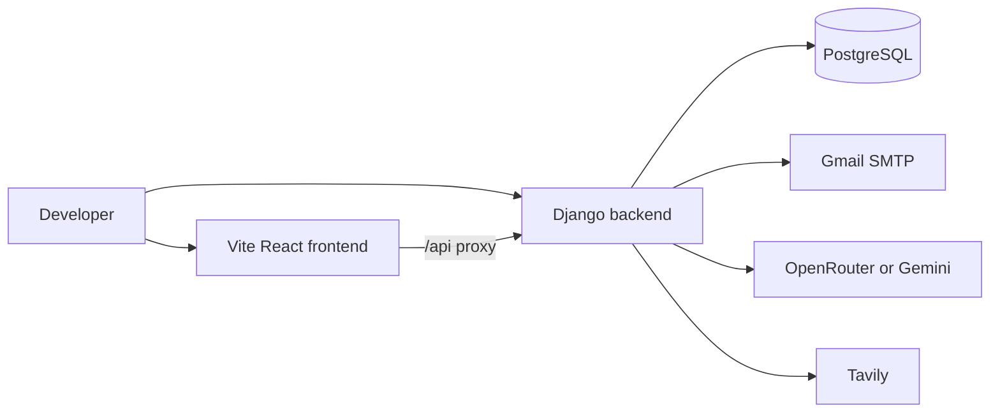
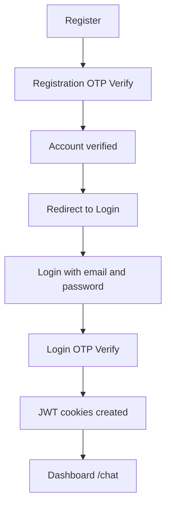
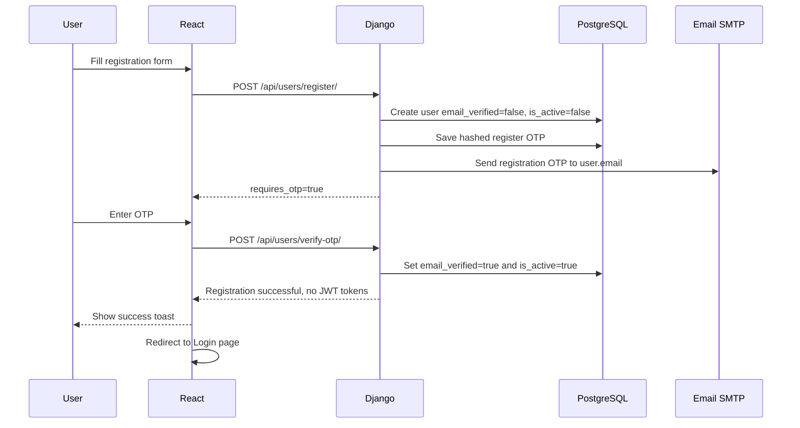
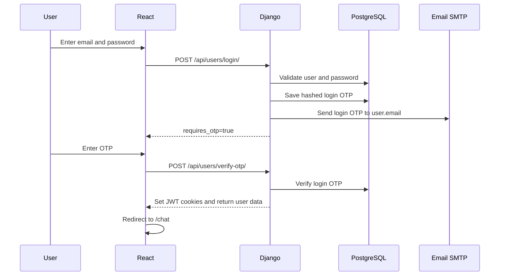
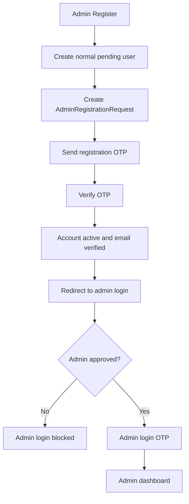
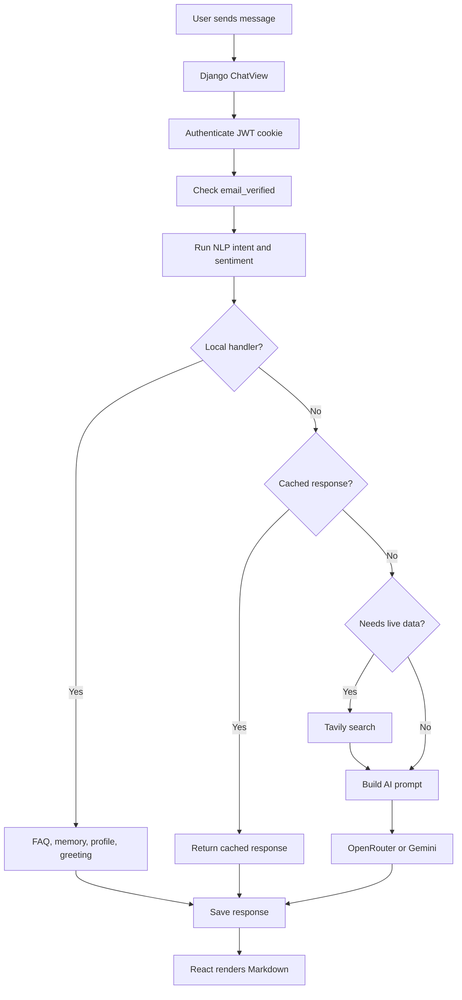
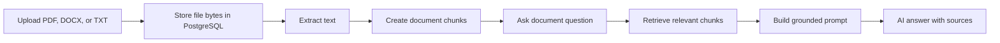
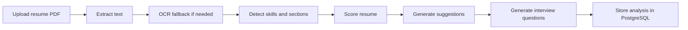

# OPTIMUS Full-Stack AI Chat

## Project Workflow Presentation

Created by Sridhar M

OPTIMUS is a secure AI assistant built with React, Django REST Framework, PostgreSQL, OTP email verification, JWT cookie authentication, NLP, RAG documents, resume analysis, Tavily search, and OpenRouter/Gemini AI providers.

---

# Key Capabilities

- Secure registration and login with email OTP.
- Registration OTP verifies the account but does not log the user in.
- Login OTP is the only step that creates JWT cookies.
- Persistent conversations, user memories, NLP analytics, and response cache.
- Live web search through Tavily for current/latest queries.
- Resume analysis and document RAG chat.
- Admin dashboard with role-based access control.

---

# Technology Stack

| Layer | Technologies |
| --- | --- |
| Frontend | React, Vite, Axios, CSS |
| Backend | Django, Django REST Framework |
| Database | PostgreSQL through Django ORM |
| Auth | Email OTP, SimpleJWT, httpOnly cookies |
| NLP | SpaCy, TextBlob, regex fallback |
| AI | OpenRouter, Google Gemini |
| Search | Tavily |
| Documents | PDF, DOCX, TXT extraction and chunking |

---

# Local Development Flow



Backend runs at `http://127.0.0.1:8000`.

Frontend runs at `http://localhost:5174` or `https://localhost:5174`.

---

# Required Auth Flow



Registration verification never creates a login session.

JWT tokens are issued only after successful login OTP verification.

---

# Registration Flow



---

# Login Flow



---

# Admin Registration Flow



Admin registration does not grant admin access automatically.

An existing admin or super admin must approve the request.

---

# Chat Request Lifecycle



---

# Memory and NLP Flow

- User messages are analyzed for intent, sentiment, and entities.
- Memory commands can save, update, delete, and retrieve user memories.
- Memory changes are written to PostgreSQL immediately.
- The frontend receives `memory_sync` so the Memory page stays current.
- Relevant memories are injected into the AI prompt for personalization.

---

# Document RAG Flow



Uploaded document content is stored in the database and used for document chat.

---

# Resume Analysis Flow



---

# Run OPTIMUS Locally

Backend:

```bash
cd backend
python -m venv venv
venv\Scripts\activate
pip install -r requirements.txt
python manage.py migrate
python manage.py runserver
```

Frontend:

```bash
cd frontend
npm install
npm run dev
```

---

# Verification Checklist

Backend:

```bash
cd backend
python manage.py check
python manage.py test users
```

Frontend:

```bash
cd frontend
npm run lint
npm run build
```

---

# Final Workflow Summary

Register

OTP Verify

Registration Successful

Redirect to Login

Login

OTP Verify

Dashboard `/chat`
