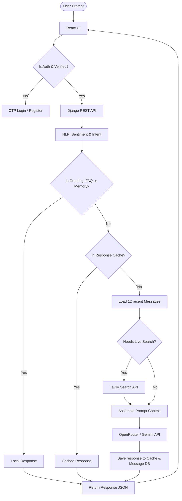
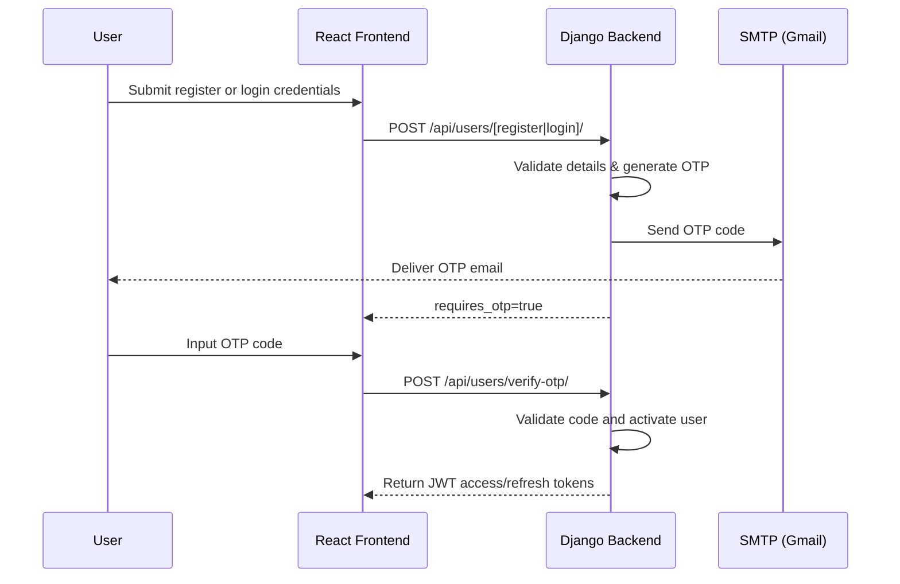
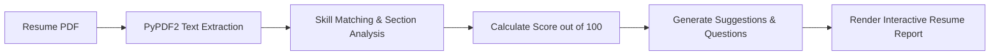

# OPTIMUS FULL Chatbot Workflow Presentation

````carousel
# OPTIMUS FULL Full-Stack AI Chat
### Architectural & Workflow Presentation Slide Deck
*Created by Sridhar*

---

> [!NOTE]
> OPTIMUS FULL is a modern, responsive, and secure full-stack AI Assistant utilizing React, Django REST Framework, JWT & OTP email authentication, TextBlob/SpaCy NLP, Tavily search, and Gemini/OpenRouter LLMs.

<!-- slide -->

## OPTIMUS FULL Key Capabilities

- **Secure Verification**: Dual-step registration and login with OTP sent via SMTP email (Gmail).
- **NLP & Local Rules**: Fast response routing for FAQs, greetings, and user profile queries.
- **Persistent Memories**: User-specific memory storage using word-overlap relevance scoring.
- **Live Search**: Tavily live search integration for real-time web querying.
- **Resume Analyzer**: PDF extraction using PyPDF2, skill scoring, and dynamic interview questions.

<!-- slide -->

## System Architecture & Tech Stack

| Layer | Technologies & Components |
|---|---|
| **Frontend** | React, Vite, Axios, Tailwind CSS / Vanilla CSS |
| **Backend** | Django REST Framework (DRF), SQLite/PostgreSQL |
| **Security** | JWT Tokens (Access/Refresh), SMTP OTP verification |
| **NLP Pipeline** | TextBlob (Sentiment), SpaCy / Regex (Entity extraction) |
| **External APIs** | Tavily Web Search, OpenRouter, Google Gemini API |

<!-- slide -->

## Request-Response Lifecycle Flow


<!-- slide -->

## User Security & OTP Flow



<!-- slide -->

## NLP & User Memories

> [!TIP]
> Memory is parsed in real-time using patterns like `remember that X is Y` or `my favorite X is Y`.

1. **Entity Extraction**: Uses SpaCy to extract entities (Names, places, dates).
2. **Sentiment Analysis**: TextBlob parses sentiment to adjust OPTIMUS FULL's empathy level.
3. **Word Overlap Scoring**: Finds relevant memories matching keywords in user prompts.
4. **Context Construction**: Assembles system instructions, user profile, memory context, NLP stats, and the last 12 chat messages before calling the LLM.

<!-- slide -->

## Live Search Integration

- **Trigger terms**: `latest`, `current`, `today`, `news`, `weather`, `stock`, `crypto`, etc.
- **Search flow**:
  1. Detects time-sensitive intent in NLP check.
  2. Makes synchronous search call to Tavily REST API.
  3. Contextualizes LLM prompt with latest web search data.
  4. Delivers contextually accurate, real-time answers.

<!-- slide -->

## Resume PDF Analyzer


- **Education/Projects/Experience parsing**: Scans headers & extracts next 6 lines.
- **Tailored Interview Preparation**: Synthesizes custom behavioral and technical interview questions based on detected skills.

<!-- slide -->

## Running OPTIMUS FULL Locally

```bash
# 1. Run Django Backend
cd backend
python -m venv venv && source venv/bin/activate
pip install -r requirements.txt
python manage.py migrate
python manage.py runserver

# 2. Run React Frontend
cd frontend
npm install
npm run dev
```
> [!IMPORTANT]
> Ensure all API keys (`TAVILY_API_KEY`, `GEMINI_API_KEY`, `OPENROUTER_API_KEY`) and Gmail SMTP parameters are configured in the `backend/.env` file.
````
